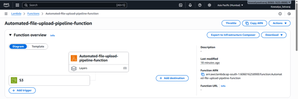
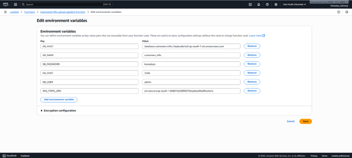
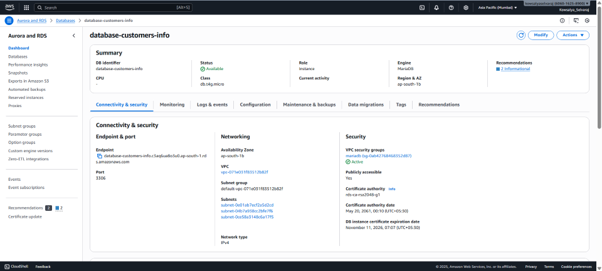
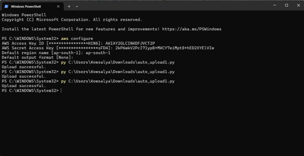
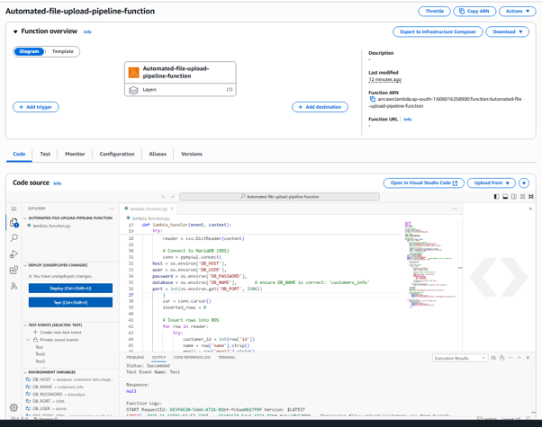
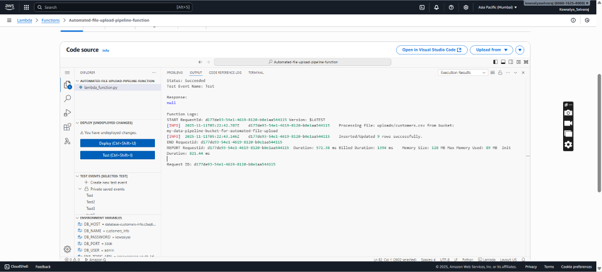
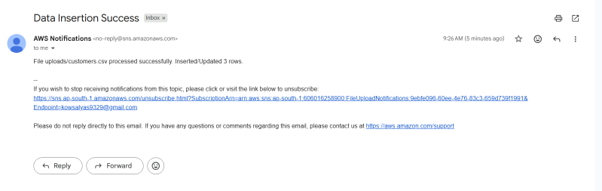
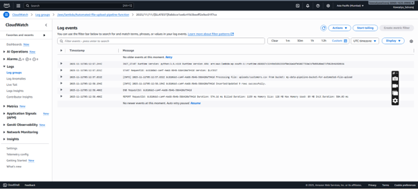

# Automated File Upload Pipeline from Local Folder to S3 → Lambda → RDS → SNS

---

## Introduction
This project focuses on designing and implementing an event-driven file ingestion pipeline on AWS. The system automatically uploads files from a local machine to an S3 bucket, processes them using Lambda, inserts the data into an RDS database, and triggers notifications via SNS.

The implementation demonstrates how AWS services such as S3, Lambda, RDS, SNS, CloudWatch, and IAM can work together to provide a scalable, automated, and reliable data pipeline.

---

## Objectives
- Upload files from a local machine to Amazon S3 automatically.
- Trigger a Lambda function upon file upload.
- Parse CSV files and insert data into an RDS database.
- Send success or failure notifications via SNS.
- Log all operations in CloudWatch for monitoring and debugging.
- Apply least-privilege IAM permissions for secure access.

---

## AWS Services Used

| Service | Purpose / Functionality |
|---|---|
| Amazon S3 | Stores uploaded files from the local machine. |
| AWS Lambda | Processes CSV files and inserts data into RDS. |
| Amazon RDS | Stores structured data for analytics and reporting. |
| Amazon SNS | Sends notifications on pipeline success or failure. |
| AWS CloudWatch | Monitors Lambda activity and logs errors. |
| AWS IAM | Manages roles and policies to secure AWS service access. |

---

## Project Implementation Details

### Step 1: S3 Bucket Setup
Created an S3 bucket "my-data-pipeline-bucket-for-automated-file-upload" to store uploaded CSV files.
Enabled event notifications to trigger Lambda functions on object creation.

---

### Step 2: Lambda Function
Developed a Python Lambda function to process CSV files.
Configured Lambda environment variables: DB_HOST, DB_NAME, DB_USER, DB_PASSWORD, SNS_TOPIC_ARN.



### Function logic:
1. Retrieves the uploaded file from S3.
2. Reads and parses the CSV content.
3. Connects to RDS and inserts data into the customers table.
4. Sends a success or failure notification via SNS.

Lambda Function (Python):

```python
import boto3
import csv
import os
import pymysql
import logging

# Initialize clients
s3_client = boto3.client('s3')
sns_client = boto3.client('sns')
sns_topic_arn = os.environ['SNS_TOPIC_ARN']

# Setup logger
logger = logging.getLogger()
logger.setLevel(logging.INFO)

# Lambda handler
def lambda_handler(event, context):
    bucket = key = "Unknown"
    try:
        # Get bucket and key from S3 event
        bucket = event['Records'][0]['s3']['bucket']['name']
        key = event['Records'][0]['s3']['object']['key']
        logger.info(f"Processing file: {key} from bucket: {bucket}")

        # Download file from S3
        response = s3_client.get_object(Bucket=bucket, Key=key)
        content = response['Body'].read().decode('utf-8').splitlines()
        reader = csv.DictReader(content)

        # Connect to MariaDB (RDS)
        conn = pymysql.connect(
    host = os.environ['DB_HOST'],
    user = os.environ['DB_USER'],
    password = os.environ['DB_PASSWORD'],
    database = os.environ['DB_NAME'],       # ensure DB_NAME is correct: 'customers_info'
    port = int(os.environ.get('DB_PORT', 3306))
        )
        cur = conn.cursor()
        inserted_rows = 0

        # Insert rows into RDS
        for row in reader:
            try:
                customer_id = int(row['id'])
                name = row['name'].strip()
                email = row['email'].strip()

                # Insert or update to avoid duplicate IDs
                sql = """
                INSERT INTO customers (id, name, email)
                VALUES (%s, %s, %s)
                ON DUPLICATE KEY UPDATE
                    name = VALUES(name),
                    email = VALUES(email);
                """
                cur.execute(sql, (customer_id, name, email))
                inserted_rows += 1

            except Exception as row_error:
                logger.warning(f"Skipping row {row} due to error: {row_error}")

        conn.commit()
        cur.close()
        conn.close()
        logger.info(f"Inserted/Updated {inserted_rows} rows successfully.")

        # Send success notification
        sns_client.publish(
            TopicArn=sns_topic_arn,
            Subject="Data Insertion Success",
            Message=f"File {key} processed successfully. Inserted/Updated {inserted_rows} rows."
        )

    except Exception as e:
        logger.error(f"Failed to process file {key}: {e}")
        sns_client.publish(
            TopicArn=sns_topic_arn,
            Subject="Data Insertion Failed",
            Message=f"Error processing file {key}: {e}"
        )
        raise e
```

---

### Step 3: RDS Configuration
Created an RDS instance (MariaDB).
Defined the customers table schema:

```sql
CREATE TABLE customers (
    id INT PRIMARY KEY,
    name VARCHAR(100),
    email VARCHAR(100)
);
```


---

### Step 4: Local File Upload Script
Developed a Python script to upload CSV files to S3 from a local machine:

```python
import boto3

s3 = boto3.client('s3')
bucket_name = 'my-data-pipeline-bucket-for-automated-file-upload'
file_path = 'customers.csv'

s3.upload_file(file_path, bucket_name, 'uploads/customers.csv')
print("Upload successful.")
```



---

### Step 5: IAM & Networking
Created an IAM role for Lambda with the following permissions:
- AmazonS3ReadOnlyAccess
- AmazonRDSFullAccess
- AmazonSNSFullAccess
- AWSLambdaBasicExecutionRole

Ensured Lambda can access RDS securely (VPC configuration if required).

---

### Step 6: CloudWatch Monitoring
- Enabled logging for Lambda invocations and errors.
- Created metric filters to detect failed inserts or errors.
- Configured alarms for high error rates to ensure pipeline reliability.

---

### Step 7: Testing and Validation

| Action | Expected Result |
|---|---|
| Upload CSV to S3 | Lambda triggers automatically |
| CSV contains new records | Records inserted into RDS successfully |
| Lambda completes | SNS sends success notification |
| Lambda fails | SNS sends failure notification |
| Logs | CloudWatch logs capture all events for auditing |







---

## Challenges Faced
- Encountered IAM permission errors → resolved by updating policies to include S3 and RDS access.
- Tested CSV parsing logic to handle edge cases and malformed data.

---

## Lessons Learned
- Learned to build an event-driven pipeline using AWS services.
- Understood the importance of proper IAM roles and security.
- Gained hands-on experience integrating S3, Lambda, RDS, SNS, and CloudWatch.
- Improved Python scripting for AWS service automation.

---

## Conclusion
This project successfully implemented an automated, event-driven data ingestion pipeline on AWS.
- Files uploaded from a local machine are automatically processed after the S3 object-creation event triggers the Lambda function, providing near-real-time data ingestion into Amazon RDS.
- Notifications are automatically sent via SNS.
- CloudWatch logs track all activity for monitoring and debugging.

The solution demonstrates a secure, scalable, and reliable architecture for enterprise-level automated data ingestion.
