# Jenkins CI/CD Pipeline: Controller -> Agent -> Tomcat Deployment

## Overview

This project demonstrates a Jenkins CI/CD pipeline that automatically builds a Java application using Maven and deploys the generated WAR file to Apache Tomcat.

The pipeline uses a Jenkins Controller and Agent architecture, where the Jenkins Agent performs the application build and deployment.

### Deployment Flow

**GitHub → Jenkins Controller → Jenkins Agent → Maven Build → WAR → Tomcat**

The project demonstrates practical DevOps concepts including Jenkins Pipeline automation, Git integration, Maven builds, Linux administration, Tomcat deployment, and Jenkins credential management.

---

## Architecture

```text
                    GitHub Repository
                           │
                           │
                           ▼
                  Jenkins Controller
                           │
                    Triggers Pipeline
                           │
                           ▼
                   Jenkins Agent
                           │
                     Maven Build
                           │
                  mvn clean package
                           │
                           ▼
                       WAR File
                           │
                           │
                           ▼
                    Apache Tomcat
                           │
                           ▼
                  Deployed Java App
```

---

## Objectives

* Set up a Jenkins Controller and Agent environment.
* Configure Java and Maven for Jenkins builds.
* Integrate Jenkins with a GitHub repository.
* Build a Java application using Maven.
* Generate a WAR deployment package.
* Deploy the WAR file automatically to Apache Tomcat.
* Configure Tomcat Manager for automated deployments.
* Store Tomcat credentials securely in Jenkins.
* Automate the complete build and deployment process using a Jenkins Pipeline.

---

# 1. Jenkins Controller Setup

Jenkins was installed on the Controller machine.

The default Jenkins port was changed to `8000` by modifying the Jenkins systemd service configuration.

Jenkins was then started and enabled using `systemctl`.

Example commands:

```bash
sudo systemctl daemon-reload
sudo systemctl start jenkins
sudo systemctl enable jenkins
sudo systemctl status jenkins
```

Java was also installed on the Jenkins Controller.

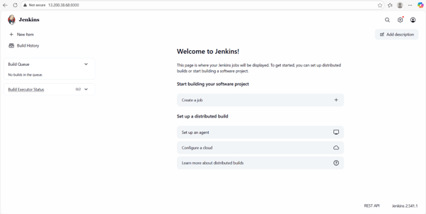

---

# 2. Jenkins Agent Setup

A separate Linux machine was configured as the Jenkins Agent.

Java was installed on the Agent because Jenkins requires Java to run the agent process.

The Agent was connected to the Jenkins Controller and assigned the label:

```text
slave_machine
```

> **Note:** Jenkins documentation commonly uses the terms Controller and Agent. The label `slave_machine` is retained here because it was used in this lab configuration.

---

# 3. Install Maven on Jenkins Agent

Apache Maven was installed on the Jenkins Agent.

Maven was verified using:

```bash
mvn -version
```

The Maven installation was configured in Jenkins Global Tool Configuration.

---

# 4. Install and Configure Apache Tomcat

Apache Tomcat was installed on the server used for application deployment.

Tomcat was started and configured as a system service.

The Tomcat Manager application was configured to allow automated deployments through the Tomcat Manager API.

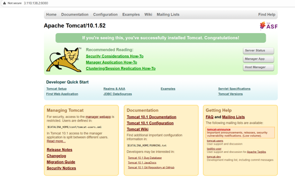
---

# 5. Configure Tomcat Manager

A Tomcat user was created with the `manager-script` role.

The configuration was added to:

```text
/opt/tomcat/conf/tomcat-users.xml
```

Example:

```xml
<role rolename="manager-script"/>

<user username="kowsalya"
      password="admin123"
      roles="manager-script"/>
```
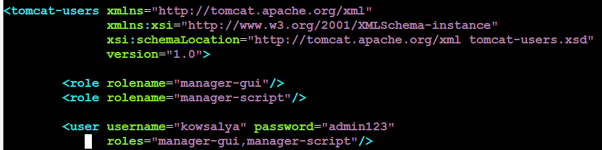

The Tomcat Manager context configuration and IP restrictions were  also updated where required.

Configuration file:

```text
/opt/tomcat/webapps/manager/META-INF/context.xml
```
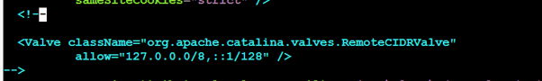

Tomcat was restarted after making the configuration changes.


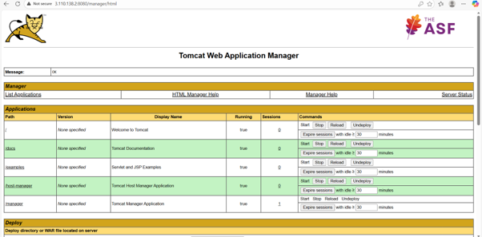

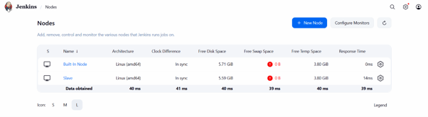

> **Security:** Do not commit the actual Tomcat password to GitHub. Jenkins credentials are used for the deployment instead.

---

# 6. Install Git on Jenkins Agent

Git was installed on the Jenkins Agent so that the pipeline could clone the application source code.

Git was verified using:

```bash
git --version
```

---

# 7. Jenkins Global Tool Configuration

The required tools were configured in Jenkins under:

**Manage Jenkins → Tools**

| Tool  | Jenkins Name | Installation Path                             |
| ----- | ------------ | --------------------------------------------- |
| Java  | `JAVA`       | `/usr/lib/jvm/java-17-amazon-corretto.x86_64` |
| Maven | `MAVEN`      | `/usr/share/maven`                            |
| Git   | `Default`    | `/usr/bin/git`                                |

The Jenkins pipeline references the configured Java and Maven installations by their Jenkins tool names.

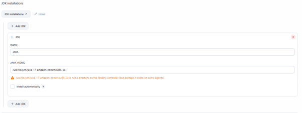

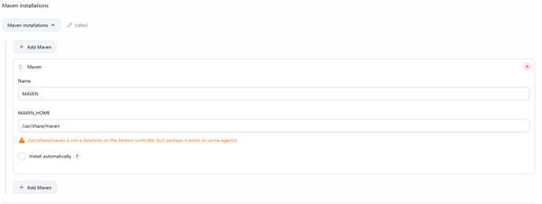
---

# 8. Configure Tomcat Credentials in Jenkins

Tomcat authentication credentials were stored securely in Jenkins.

A Jenkins credential was created with the ID:

```text
tomcat-creds
```

The pipeline retrieves these credentials using Jenkins' `withCredentials` functionality.

The password is therefore not stored directly inside the pipeline script.

---

# 9. Jenkins Pipeline

The following Jenkinsfile automates the complete process:

1. Checkout source code from GitHub.
2. Build the Java application using Maven.
3. Generate the WAR file.
4. Deploy the WAR file to Tomcat using the Tomcat Manager API.

```groovy
pipeline {
    agent { label 'slave_machine' }

    tools {
        maven 'MAVEN'
        jdk 'JAVA'
    }

    environment {
        TOMCAT_URL = "http://<TOMCAT_SERVER_IP>:8080/manager/text"
        APP_NAME = "KOWSALYA_JENKINS"
    }

    stages {

        stage('Checkout') {
            steps {
                git branch: 'main',
                    url: 'https://github.com/Harsha463/java-jenkins-pipeline.git'
            }
        }

        stage('Build') {
            steps {
                sh 'mvn clean package'
            }
        }

        stage('Deploy to Tomcat') {
            steps {
                withCredentials([
                    usernamePassword(
                        credentialsId: 'tomcat-creds',
                        usernameVariable: 'TOMCAT_USER',
                        passwordVariable: 'TOMCAT_PASS'
                    )
                ]) {
                    sh '''
                    curl -u $TOMCAT_USER:$TOMCAT_PASS \
                    -T target/*.war \
                    "$TOMCAT_URL/deploy?path=/$APP_NAME&update=true"
                    '''
                }
            }
        }
    }
}
```

> **Important:** Replace `<TOMCAT_SERVER_IP>` with the appropriate Tomcat server address in your Jenkins environment. 

---

# 10. Pipeline Stages

### Stage 1 — Checkout

Jenkins connects to the Git repository and downloads the application source code.

```text
GitHub → Jenkins Agent
```

### Stage 2 — Build

Maven builds the Java application:

```bash
mvn clean package
```

This generates a WAR file under:

```text
target/
```

### Stage 3 — Deploy

The generated WAR file is uploaded to Tomcat using the Tomcat Manager API.

```text
WAR → Tomcat Manager → Application Deployment
```

---

# 11. Execution Flow

The complete execution flow is:

```text
1. Jenkins Controller triggers the pipeline
                    ↓
2. Jenkins Agent starts the pipeline
                    ↓
3. Agent clones the GitHub repository
                    ↓
4. Maven builds the Java application
                    ↓
5. WAR file is generated
                    ↓
6. Jenkins retrieves Tomcat credentials
                    ↓
7. WAR file is uploaded to Tomcat
                    ↓
8. Tomcat deploys the application
                    ↓
9. Application becomes available
```

---

# 12. Testing and Validation

The pipeline was tested by triggering a Jenkins build.

### Expected Results

| Test                    | Expected Result                           |
| ----------------------- | ----------------------------------------- |
| Jenkins pipeline starts | Pipeline executes on the configured Agent |
| Git checkout            | Source code successfully downloaded       |
| Maven build             | Build completes successfully              |
| WAR generation          | WAR file created in `target/`             |
| Tomcat deployment       | WAR successfully deployed                 |
| Application access      | Application available through Tomcat      |
| Pipeline completion     | Jenkins reports successful build          |

---

# 13. Deployment Verification

After a successful Jenkins build, the deployed application can be verified through the Tomcat Manager interface or application URL.

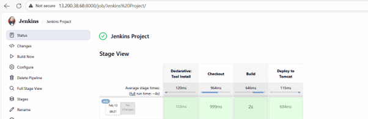

Example:

```text
http://<TOMCAT_SERVER_IP>:8080/KOWSALYA_JENKINS
```

A successful deployment confirms that the CI/CD pipeline completed the build and deployment process automatically.

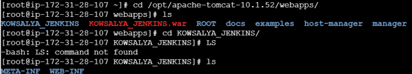

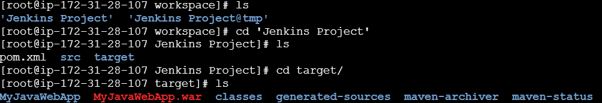

---

# 14. Challenges Faced

* Configuring Jenkins Controller and Agent communication.
* Installing and configuring Java and Maven.
* Configuring Tomcat Manager for automated deployment.
* Managing Jenkins credentials securely.
* Troubleshooting Maven build failures.
* Troubleshooting Tomcat deployment and authentication issues.
* Ensuring the Jenkins Agent had the required tools and permissions.

---

# 15. Key Concepts Learned

Through this project, I gained hands-on experience with:

* Jenkins Controller/Agent architecture
* Jenkins Declarative Pipelines
* Git and GitHub integration
* Maven
* Java application builds
* WAR packaging
* Apache Tomcat
* Tomcat Manager API
* Jenkins Credentials
* Linux system administration
* CI/CD automation
* Automated application deployment

---

# 16. Technologies Used

| Technology    | Purpose                         |
| ------------- | ------------------------------- |
| Jenkins       | CI/CD automation                |
| GitHub        | Source code management          |
| Java          | Application runtime/build       |
| Maven         | Application build and packaging |
| Apache Tomcat | Application server              |
| Linux         | Server operating system         |
| Groovy        | Jenkins Pipeline scripting      |
| cURL          | Tomcat deployment               |

---

# 17. Project Outcome

The project successfully demonstrates an automated CI/CD workflow where a Java application is retrieved from GitHub, built on a Jenkins Agent using Maven, packaged as a WAR file, and automatically deployed to Apache Tomcat.

This eliminates the need for manually copying and deploying the application after every build and demonstrates the core principles of continuous integration and continuous deployment.

---

## Project Screenshots

Screenshots documenting the Jenkins configuration, Agent connection, Maven setup, pipeline execution, and Tomcat deployment are available in the `images` directory.

---

## Conclusion

This project provided practical experience in building a complete Jenkins-based CI/CD pipeline.

The final workflow automates the process from source-code checkout through application build and deployment:

**GitHub → Jenkins Controller → Jenkins Agent → Maven → WAR → Tomcat**

It demonstrates how DevOps tools can be integrated to create a repeatable and automated application deployment process.
