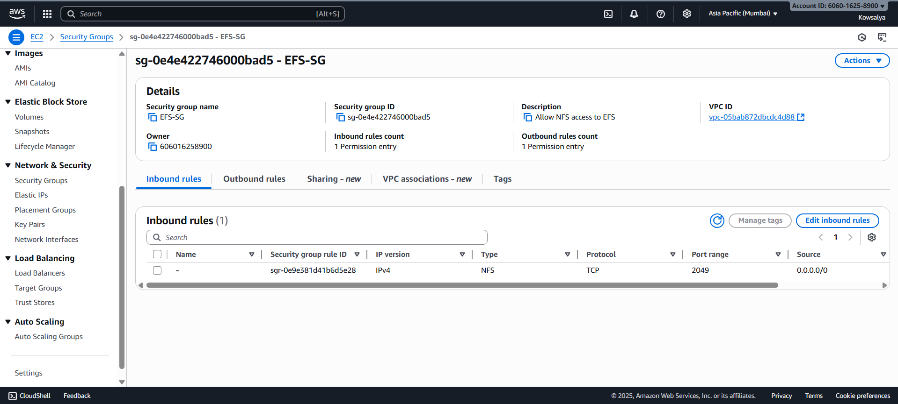
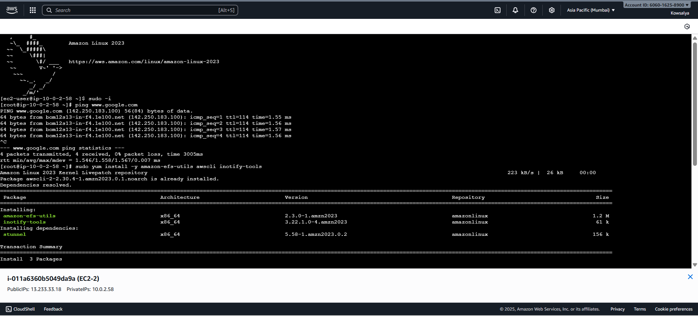
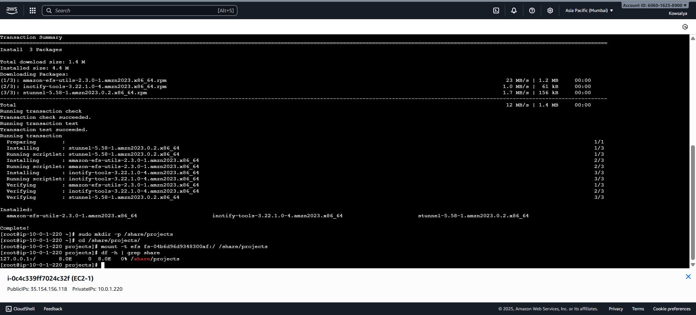
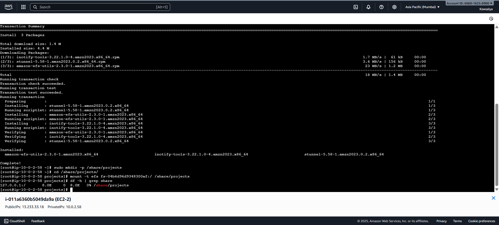
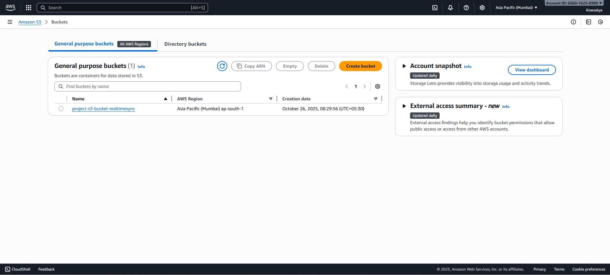
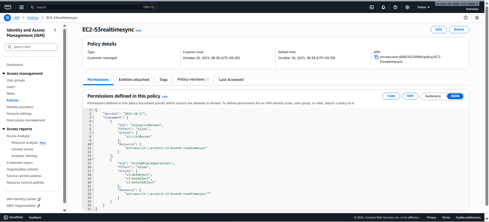

# EFS-S3 Realtime Sync Project

## Introduction

This project focuses on designing and implementing a centralized file-sharing and backup system within AWS using a custom Virtual Private Cloud (VPC).
The goal is to ensure that files shared between two EC2 instances using Amazon Elastic File System (EFS) are automatically synchronized with an Amazon S3 bucket in near real-time.

This implementation demonstrates how core AWS services such as EC2, EFS, S3, VPC, and IAM can be combined to provide a scalable, cost-effective, and automated cloud storage solution without using advanced automation services like Lambda or DataSync.

---

## Objectives

* Design a custom AWS VPC for secure networking and internet connectivity.
* Launch two EC2 instances in different subnets and mount a common EFS file system.
* Create an Amazon S3 bucket to store and back up all project files from EFS.
* Implement a near real-time sync mechanism between EFS and S3 using `inotify` and AWS CLI.
* Enforce least-privilege IAM permissions for secure and controlled access.
* Enable bi-directional sync, ensuring changes from either EC2 instance are reflected in S3.

---

## AWS Services Used

| Service    | Purpose / Functionality                                                                                    |
| ---------- | ---------------------------------------------------------------------------------------------------------- |
| Amazon VPC | Provides an isolated virtual network environment for EC2, EFS, and S3 communication                        |
| Amazon EC2 | Compute instances where EFS is mounted and file sync operations are performed                              |
| Amazon EFS | Shared file system accessible by multiple EC2 instances for centralized file sharing                       |
| Amazon S3  | Object storage used to mirror and back up files from EFS in near real-time                                 |
| AWS IAM    | Creates roles and policies following least-privilege principles, allowing EC2 to interact securely with S3 |

---

## Project Implementation Details

### Step 1: VPC Setup

* Created a custom VPC (`10.0.0.0/16`) with two public subnets in different Availability Zones.
* Attached an Internet Gateway (IGW) for internet connectivity.
* Configured route tables with `0.0.0.0/0 → IGW`.
* Created security groups:

  * **EC2 SG**: Allowed SSH (port 22)
  * **EFS SG**: Allowed inbound NFS (2049)



---

### Step 2: EC2 Instances

* Launched two Amazon Linux 2023 EC2 instances in separate subnets (AZ-A and AZ-B).
* Verified internet access and installed necessary packages:

```bash
sudo yum install -y amazon-efs-utils awscli inotify-tools
```



---

### Step 3: Amazon EFS Configuration

* Created a new EFS file system within the same VPC.
* Created mount targets in both subnets.
* On both EC2s:

```bash
sudo mkdir -p /share/projects
sudo mount -t efs fs-04b6d96d9348300af:/ /share/projects
df -h | grep share
```





---

### Step 4: Amazon S3 Bucket

* Created a dedicated S3 bucket named `project-s3-bucket-realtimesync`.

---

### Step 5: IAM Role and Policy

* Created an IAM role `EC2Realtimesync` and attached an inline policy allowing necessary S3 actions.
* Attached this role to both EC2 instances.



---

### Step 6: Near Real-Time Sync Using inotify + AWS CLI

```bash
nohup inotifywait -m -r -e create -e modify -e moved_to -e moved_from -e delete -e delete_self /share/projects --format '%e %w%f' | while read EVENT FILE; do
    if [[ "$EVENT" =~ CREATE|MODIFY|MOVED_TO ]]; then
        aws s3 cp "$FILE" s3://project-s3-bucket-realtimesync/"${FILE#/share/projects/}" 2>/dev/null
    elif [[ "$EVENT" =~ DELETE|MOVED_FROM|DELETE_SELF ]]; then
        aws s3 rm s3://project-s3-bucket-realtimesync/"${FILE#/share/projects/}" 2>/dev/null
    fi
done &
```

* `inotifywait` monitors `/share/projects` for any file changes.
* Changes automatically trigger `aws s3` to update S3, ensuring near real-time sync.

---

### Step 7: Testing and Validation

| Action                       | Expected Result                                   |
| ---------------------------- | ------------------------------------------------- |
| Created file on EC2-1        | File appeared in S3 within seconds                |
| Modified file on EC2-2       | Updated version synced to S3                      |
| Deleted file on EC2-1        | File removed from S3                              |
| Both EC2 instances monitored | Changes reflected on both due to shared EFS mount |

---

## Challenges Faced

* IAM permission errors initially due to missing `ListBucket` access. Solved by updating IAM policy.
* Tuning `inotify` parameters was needed for recursive monitoring.

---

## Lessons Learned

* Learned how to integrate core AWS services manually without managed automation tools.
* Understood the importance of least-privilege IAM policies for security.
* `inotifywait` + `aws s3 sync` is a simple yet powerful solution for near real-time replication.
* Gained hands-on experience with VPC networking, EFS mounts, and CLI-based automation.

---

## Conclusion

This project successfully implemented a centralized file-sharing and synchronization system using only EC2, EFS, S3, VPC, and IAM.
Files modified in EFS were automatically uploaded to S3 in near real-time using an event-driven approach (`inotify + AWS CLI`).

**Future Improvements:**

* Integrating event logging with CloudTrail.
* Implementing version control for backup recovery.

---

### Output Screenshots

* VPC topology diagram
* Security Group configuration
* EC2 instances – package installation
* EC2 instances with EFS mount
* IAM policy JSON

---

### Results

All objectives achieved: secure architecture, minimal service usage, bi-directional synchronization.

